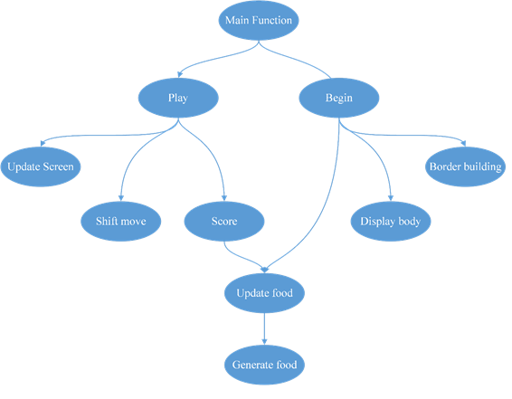

# Snake-game

Everyone knows the famous game Snake Eating Apples where the player has to direct a snake to eat apples.you will find here a simple code using `graphics.h` as the main library for graphics and shapes.

## Code structure:
Our code is consisting of one struct and some functions.

### Struct cord:
Cord is an abbreviation of coordinate. Its data structure has x, x-coordinate, and y, y-coordinate, integers numbers. Two instances of data structure were created to achieve the purpose of implementing.

### Function Generate food:
It is a void function for generating food in the form of circles with a red colour using random sequence using a parameter time (built-in function). The border of the screen is put into consideration so it does not appear outside the screen. Small modifications were also done to align the food with the same path of the snake.

### Function Update food:
It is a void function. When the snake eats the food (apple) this function need to clean the food from position and generate a different one by calling the previous function.

### Function Score:
In This void function checks if the snake ate the apple or not. If the snake ate the apple it increases the user’s score, length of the snake and regenerates a different red circle using (update food function) then clears the score by making a rectangle over the old one and filling it with the same colour of background then viewing the new score after eating.

### Function Border building:
It is a void function used to draw four lines on the borders of the screen.

### Function Display body:
This void function is to draw the circles of the snake one by one.

### Function Shift move:
It is a void function. the snake consists of several circles every circle has its own x and y coordinates so when the function is called it starts swapping every circle of the snake by the one in front of it.

### Function Update screen:
This function is responsible for drawing the head of snake (The first circle) in the new position of it and removing the tail (The last circle) in the old position of it.

### Function Begin:
This void function called in the beginning of the code to set some beginning values (snake length, snake location and snake direction), draw the snake body, border lines and apple through update food function, border building function and display body.

### Function play:
This void function is the most important function which take the input from the user and change the direction of the snake through changing the direction of his head, first it calls update screen function then shifts move then it delays for a time which is considered as the speed of the game. Also it checks that the snake didn’t eat itself or hits the borders and update the apple position if it is on the body of the snake through generate food function.

## Code Flowchart

## Screenshot of the code

## How to use
To run the code you will need to install turbo c++ or you can just check fot this link to run the code on codeblocks [here](https://stackoverflow.com/questions/20313534/how-to-use-graphics-h-in-codeblocks)
